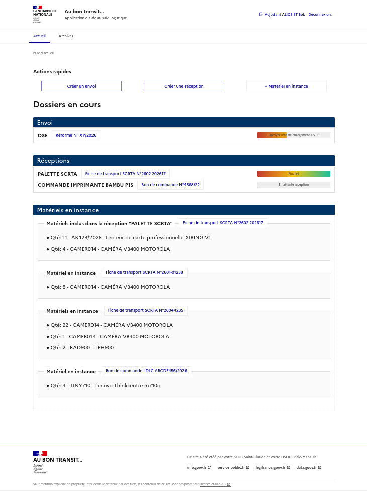
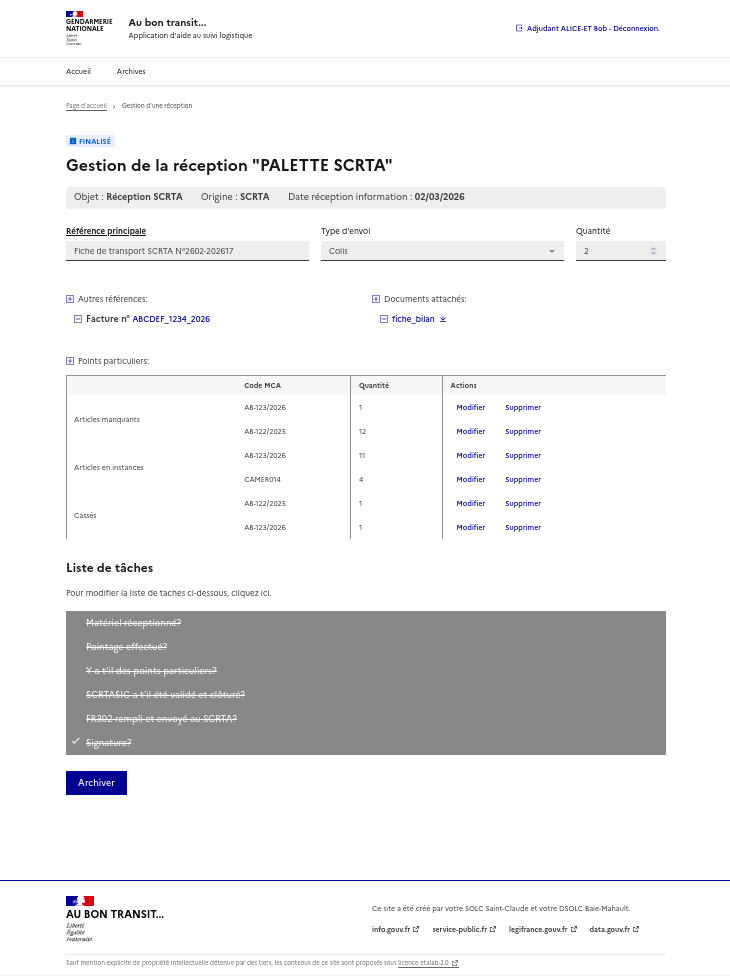

# Au bon transit | Application d'aide au suivi logistique SOLC

## Description
Une application web sécurisée et intuitive pour suivre les livraisons à destination ou en partance des SOLC. Elle permet aux utilisateurs de ces unités de créer et gérer des envois ou des réception de colis ou palettes, ainsi que le matériel en instance. 

Cette application a été pensée pour les seules unités SOLCde la Gendarmerie Naionale et n'a pas vocation à être adaptée aux besoins d'autres unités ou administrations tant elle répond à un besoin très spécifique.



## Fonctionnalités
- Création d'envois ou de réceptions,
- Centralisation de toutes les références (fiches de transport, N° de factures, etc... ) et de tous les documents liés à une expédition,
- Listes de taches intégrées et personnalisables afin d'éviter tout oubli dans le process de gestion,
- Interface utilisateur utilisant le <abbr title="Système de Design de l'État">DSFR</abbr>&copy;, moderne et responsive, en cohérence avec les sites étatiques
- Authentification des utilisateurs et insertion en BDD via SSO et LDAP.

## Prérequis
- PHP (version 7.2 ou supérieure) 
- Symfony&copy; et Composer
- Node.js et NPM
- MySQL&copy; (pour la base de données)
- Navigateur web moderne (cible: Firefox 140-esr, mais supporte très bien Chrome, Firefox, Safari, etc.)

## Installation
1. Clonez le dépôt :
   ```bash
   git clone https://github.com/loicdurand/transit.git
   ```
2. Accédez au répertoire du projet :
   ```bash
   cd transit
   ```
3. Installez les dépendances :
   ```bash
   npm install      # installe les dépendances (packages) NPM
   composer install # installe les dépendances (bundles) PHP
   ```
4. Configurez les variables d'environnement dans un fichier `.env` :
   ```env
    APP_ENV=dev

    LDAP_HOST=ldap://mon_ldap.domaine.fr
    LDAP_PORT=389
    LDAP_USER=admin 
    LDAP_PASSWORD=mot_de_passe
    BASE_DN='dc=exemple,dc=fr'

    COOKIE_NAME=nom_du_cookie
    COOKIE_DOMAIN=localhost
    PORTAL_URL='http://adresse_de_mon_sso/login'
    REST_URL='http://adresse_de_mon_sso/validate' 
    MAIL_URL='https://adresse_de_mon_sso/mail' # Pas encore implémenté
    
   ```
1. Lancez l'application :
   ```bash
   # PRÉPARATION DE LA BASE DE DONNÉES
   php bin/console doctrine:database:create
   php bin/console make:migration
   php bin/console doctrine:migrations:migrate
   php bin/console doctrine:fixtures:load

   # BUILD DES ASSETS
   php bin/console asset-map:compile
   npm run build

   # DÉMARRAGE DU SERVEUR
   npm run server
   ```
2. Accédez à l'application via `http://localhost:8000` dans votre navigateur.

## Utilisation
1. **Créer un envoi, une réception ou un matériel en instance** : ***Transit*** n'utilise pas de compte administrateur. Lorsque vous vous connectez au site, vous êtes libre de créer ces expéditions. Elles seront visibles par tout utilisateur se connectant à l'application. Il convient donc de limiter l'accès à l'app **en amont**, c'est à dire en masquant l'URL aux personnels non intéressés.
2. **Liste de taches personnalisée** : En fonction de l'objet de votre expédition, vous pouvez créer une liste de taches spécifique, qui servira ensuite de modèle pour les futurs envois du même type. Chaque tache non encore réalisée a un statut (ex: en attente du document XXX/AAAA) associé, facilitant le suivi.
3. **Centralisation des documents et références** : Chaque expédition regroupe autant de références et de documents (PDF uniquement) que vous le souhaitez, afin de retrouver facilement ces éléments en un seul endroit.
4. **Archivage** Lorsque toutes les taches ont été réalisées, l'expédition peut être archivée. Il est très facile de la retrouver plus tard, et même de la réactiver si cela s'avère nécessaire.



## Technologies utilisées
- **Backend** : PHP, Symfony&copy;
- **Frontend** : TypeScript très léger
- **Base de données** : MySQL
- **Authentification** : Via SSO et LDAP
- **Hébergement** : Le site est hébergé sur serveur INTRANET local. Il n'est donc pas accessible au grand public et son accès est limité à l'administration pour laquelle il a été conçu.

## Contribution
Nous accueillons les contributions ! Pour participer :
1. Forkez le dépôt.
2. Créez une branche pour votre fonctionnalité (`git checkout -b feature/nouvelle-fonction`).
3. Commitez vos changements (`git commit -m "Ajout de nouvelle fonctionnalité"`).
4. Poussez votre branche (`git push origin feature/nouvelle-fonction`).
5. Ouvrez une Pull Request.

Veuillez lire notre [guide de contribution](CONTRIBUTING.md) pour plus de détails.

## Licence
S'agissant d'un projet conçu pour une administration française, et utilisant le <abbr title="Système de Design de l'État">DSFR</abbr>&copy;, celui-ci est [sous licence ouverte Etalab 2.0](https://www.etalab.gouv.fr/wp-content/uploads/2017/04/ETALAB-Licence-Ouverte-v2.0.pdf). Vous êtes libres de l'adapter à vos besoins si vous ne travaillez pas pour le compte d'une administration française, notament en retirant les éléments de design du <abbr title="Système de Design de l'État">DSFR</abbr>&copy;, ce qui est relativement aisé si vous avez l'habitude de'utiliser des bibliothèques telles Bootstrap&copy;, Materialize.css&copy;, voire Tailwind&copy;

## Contact
Pour toute question ou suggestion, ouvrez une issue sur GitHub.